# IoT Network Intrusion Detection: CNN-LSTM IDS on CICIoT2023

This project reproduces **Gueriani, Kheddar & Mazari, "Enhancing IoT Security with CNN and LSTM-Based
Intrusion Detection Systems", IEEE PAIS 2024** (DOI [10.1109/PAIS62114.2024.10541178](https://doi.org/10.1109/PAIS62114.2024.10541178),
preprint [arXiv:2405.18624](https://arxiv.org/abs/2405.18624)). The model classifies IoT traffic as benign or malicious.

Team: Aayushman (231CS105), Ashutosh Kumar (231CS113), Sahil Mengji (231CS151)

This is a scientific reproduction, not a new method. We rebuilt the paper's CNN-LSTM, trained it on
CICIoT2023 and compare Accuracy, Precision, Recall and F1 against the paper's reported **98.42 %**
accuracy. Every deviation is documented.

---

## 1. Assumptions and uncertain paper details

All of these are also tagged `[paper]` or `[assumed]` in `config.py`.

| Item | Source | Value used |
|---|---|---|
| Architecture topology | **paper, Fig. 2** (read from the layer kernel shapes) | Conv1D(64,k3) → BN → AvgPool → Conv1D(64,k3) → AvgPool → Flatten → Dense32 → Dense16 → [Dense(2,softmax) ‖ Reshape(16,1) → LSTM64 → LSTM64 → Dense(2,sigmoid)] → Concat → Dense(2,softmax) |
| Padding / pool size | *assumed*, but consistent with the paper's Flatten = 576 = 9×64 for 45 inputs | `valid`, pool 2 |
| Activations | *assumed*: the paper only says "ReLU" for the dense layers | ReLU for convs and dense layers |
| Epochs, optimiser | paper, Sec. IV-C | 25, Adam |
| Batch size, learning rate | *assumed* (not stated) | 256, 1e-3 |
| Dropout | paper Fig. 2 shows none | 0 |
| Callbacks | *assumed* (from project brief) | EarlyStopping(val_loss, patience 5, restore best), ReduceLROnPlateau(×0.5, patience 2), ModelCheckpoint, CSVLogger |
| Input features | paper says 45 but does not say which of the 46 CSV features was dropped | the 46 original features, minus columns that are constant on train |
| Data subset | paper: 1,191,264 train/val rows (80/20) plus a separate 1,175,692-row test subset | 1.4 M random rows, de-duplicated, stratified 70/15/15 split (project brief) |
| Normalisation, imbalance handling, de-duplication | not mentioned in the paper | MinMax fitted on train, `class_weight="balanced"`, exact duplicates removed before splitting |
| Paper metrics | published abstract (DOI 10.1109/PAIS62114.2024.10541178, via OpenAlex/Crossref) confirms accuracy 98.42 %, F1 98.57 %, FPR 9.17 %, loss 0.0275 | used in `config.PAPER_RESULTS`. Precision and recall are only in the full-text Table IV (not accessible), so they stay `None` with a TODO. |
| Metric convention | unknown whether the paper's P/R/F1 are weighted or attack-positive | we report both, plus benign-class P/R/F1, FPR, FNR, MCC, ROC-AUC, PR-AUC and an always-malicious baseline |

We also save a validation-split classification report (`classification_report_CNN-LSTM_validation.txt`),
because papers on this dataset often report validation numbers.

The project brief's generic CNN-LSTM (Conv64/128 with MaxPool and Dropout → LSTM64 → Dense64) is available
as `--architecture generic`.

## 2. Project layout

```
iot_ids_cnn_lstm/
├── config.py            all hyper-parameters, paths, seeds, paper numbers (tagged [paper]/[assumed])
├── download_data.py     fetches CICIoT2023 CSVs from public mirrors of the official release
├── data_loader.py       chunked, float32-downcast, stratified-in-expectation sampling, synthetic fallback
├── preprocessing.py     cleaning, label maps (binary / 8 families / 34 classes), split, scale, balance
├── model.py             paper CNN-LSTM, generic CNN-LSTM, CNN / LSTM / MLP baselines, Random Forest
├── train.py             GPU setup, seeds, callbacks, RF, leakage-free k-fold CV
├── evaluate.py          metrics and figures 1-22 (+ slide versions)
├── compare_with_paper.py  table, figure 18, deviation analysis
├── edge_deploy.py       TFLite float32 / dynamic-range int8 export and latency benchmark (figure 23)
├── main.py              staged, resumable CLI (prepare / train / baselines / cv / compare / edge)
├── runtime.py           RAM + wall-time logging per stage (stage_runtime.json)
├── simulation.py        live traffic-replay animation of the trained model (MP4 / GIF)
├── test_leakage.py      pytest: disjoint splits, train-only scaler, class weights, undersampling, labels
├── test_pipeline.py     pytest: .npy cache round-trip, cache-signature check, training resume
├── tools/detach.sh      launch long jobs detached (setsid) with a log file
├── tools/make_reports.py  README results, RESULTS_SUMMARY / RUNTIME_NOTES / GOAL_CHECKLIST from metrics files
├── tools/make_notebook.py regenerates the notebook
├── tools/profile_memory.py per-stage peak-RAM profiler
├── IoT_IDS_CNN_LSTM.ipynb   Colab-friendly walkthrough (calls main.py, then explains every result)
└── outputs/{figures,figures/slides,metrics,models}
```

## 3. Setup

**GPU on Windows:** TensorFlow 2.11 and later has no native-Windows GPU build, so use WSL2
(Ubuntu). This is how the results below were produced on an RTX 4060 Laptop GPU.

```bash
# WSL2 / Linux / Colab
python3 -m venv ~/venvs/ids && source ~/venvs/ids/bin/activate
pip install -r requirements.txt            # installs tensorflow[and-cuda] on Linux
python -c "import tensorflow as tf; print(tf.config.list_physical_devices('GPU'))"
```

## 4. Dataset download

The official page (https://www.unb.ca/cic/datasets/iotdataset-2023.html) requires a registration
form. `download_data.py` fetches the same files from public Hugging Face mirrors:

```bash
python download_data.py --release original   # 46-feature release used by the paper -> data/original/ (~2.2 GB)
python download_data.py --release merged     # optional 2024 re-release, 39 features -> data/merged_2024/ (~8.7 GB)
```

`data/original/CICIOT23/{train,validation,test}/*.csv` holds 7,845,673 rows, all 34 labels and
46 features. The loader ignores the mirror's own split: it pools every CSV and re-splits. Any folder of
CICIoT2023 CSVs works with `--data_dir`, including the official `part-*.csv` files and `MERGED_CSV`,
because the label column (`label` or `Label`) and the label casing are detected automatically.

## 5. Run

```bash
python -m pytest -q test_leakage.py test_pipeline.py        # leakage, cache and resume tests (~15 s)
python main.py --smoke_test --stage all --run_baselines --cv --edge   # 5k rows, 2 epochs, all stages (~1 min)
```

The full run is split into stages. Each stage writes its outputs as soon as it finishes and is skipped
on the next call unless you pass `--force`. Training checkpoints every epoch (model + optimizer state +
early-stopping counters) and **resumes automatically** after an interruption.

| Stage | Writes |
|---|---|
| `prepare` | `outputs/cache/*.npy` (float32 train/val/test arrays, test sub-labels, CV subset), `meta.json`, scaler, figs 1-5 |
| `train` | `outputs/models/CNN-LSTM.keras`, metrics, figs 6-16, 20, 21 |
| `baselines` | CNN / LSTM / MLP / Random Forest (300k-row subsample) → figs 11, 12, 17, 19 |
| `cv` | 5-fold CV on a 150k-row cached subset → fig 22 |
| `compare` | paper table, fig 18, `deviation_analysis.txt` |
| `edge` | TFLite export + benchmark → fig 23 |

Launch long jobs **detached**, so a closed terminal, IDE or agent session cannot kill them:

```bash
tools/detach.sh run_main.log 'python main.py --stage prepare --sample 1400000 && python main.py --stage train --sample 1400000 --epochs 25'
tail -f run_main.log                  # poll; re-running the same command resumes if it died
tools/detach.sh run_stages.log 'python main.py --stage baselines,cv,compare,edge --sample 1400000'
python tools/make_reports.py          # fills the results section below from the metrics files
```

Every later stage reads only the cached arrays (memory-mapped). `--use_cache` makes this explicit
and fails instead of re-reading CSVs. The cache records the settings that built it, and a mismatch
(different `--sample`, seed or task) is refused.

Useful flags:
- `--task multiclass_8|multiclass_34`
- `--architecture generic`
- `--balance none|class_weight|undersample`
- `--scaler standard`
- `--sample 0` (use every row; needs about 12 GB RAM)
- `--data_dir data/merged_2024`
- `--deterministic` (TF op determinism, slower)
- `--mixed_precision`
- `--no_tsne`

If no CSVs are found, `--smoke_test` falls back to a clearly labelled **synthetic** dataset.
The figures get a "SYNTHETIC" watermark and the log warns loudly. Never report those numbers.

Re-generate only the paper comparison from a finished run: `python compare_with_paper.py`.

## 6. Outputs

| Figure | File (`outputs/figures/`) |
|---|---|
| 1 Class distribution: full data → sample → train before/after balancing | `01_class_distribution.png` |
| 2 Top-15 attack types (log scale) | `02_top15_attack_types.png` |
| 3 Correlation heatmap, top-20 label-correlated features | `03_feature_correlation.png` |
| 4 Key-feature boxplots, benign vs malicious | `04_feature_boxplots.png` |
| 5 NaN / inf per column before cleaning | `05_missing_inf_summary.png` |
| 6 / 7 Training vs validation accuracy / loss | `06_training_accuracy.png`, `07_training_loss.png` |
| 8 Learning-rate schedule | `08_learning_rate.png` |
| 9 / 10 Confusion matrix, counts / normalised (TP, TN, FP, FN labelled) | `09_…`, `10_…` |
| 11 / 12 ROC / PR curves (all models) | `11_roc_curve.png`, `12_pr_curve.png` |
| 13 Accuracy / Precision / Recall / F1 bars | `13_metric_bars.png` |
| 14 P(malicious) histogram with threshold | `14_probability_histogram.png` |
| 15 Threshold sweep | `15_threshold_sweep.png` |
| 16 Per-class F1 (multiclass only) | `16_per_class_f1.png` |
| 17 Model comparison | `17_model_comparison.png` |
| 18 Ours vs paper (98.42 % reference line) | `18_paper_comparison.png` |
| 19 Inference time and model size | `19_inference_cost_comparison.png` |
| 20 Error rate per attack sub-type | `20_error_by_attack_type.png` |
| 21 t-SNE of LSTM embeddings | `21_tsne_lstm_embeddings.png` |
| 22 5-fold CV box plot | `22_cross_validation.png` |
| 23 TFLite edge benchmark | `23_edge_tflite_benchmark.png` |
| Slide versions (16:9) of 6, 7, 9, 11, 13, 17, 18 | `figures/slides/` |

Metrics (`outputs/metrics/`):
- `results.json` and `results.csv` (every model and metric, run info)
- `classification_report_*.txt/csv`
- `paper_comparison.csv/md`
- `deviation_analysis.txt`
- `history_*.csv`
- `cv_results.csv`
- `error_by_attack_type.csv`
- `edge_benchmark.csv/md`
- `label_mapping.json`
- `model_summary*.txt`
- `run.log`

Models (`outputs/models/`):
- `CNN-LSTM.keras` and the baseline `.keras` files
- `RandomForest.joblib`
- `scaler.joblib`
- `cnn_lstm_float32.tflite`, `cnn_lstm_dynamic.tflite`

<!-- RESULTS:START -->
## 7. Results (full run, real CICIoT2023 data)

**Setup actually used:** original 2023 release (46 features); requested sample 1,400,000 of
7,845,673 rows (per-chunk stratified sampling) → 1,399,311 sampled →
1,225,709 after removing 173,602 exact duplicates.
Split 70%/15%/15% train/val/test (stratified): train 857,995 / val 183,857 / test 183,857.
41 of 46 features used (train-constant columns dropped:
ece_flag_number, cwr_flag_number, Telnet, SMTP, IRC). Class weights (train-only, 'balanced'): benign 18.81, malicious 0.514.
CNN-LSTM trained on the RTX 4060 Laptop GPU (/physical_device:GPU:0, WSL2): **25 epochs run** (max 25),
best val_loss at **epoch 23**,
16.6 min; seed 42; batch 256; lr 0.001.
All numbers below are on the held-out **test** split (183,857 flows).

### 7.1 Headline table (percent unless noted; positive class = malicious)

Accuracy alone is misleading here: 97.34% of test flows are attacks,
so the *always-malicious* row already reaches that accuracy with 0% benign recall and MCC 0. The benign
columns, FPR, MCC and PR-AUC show what the models actually learn.

| Model | Accuracy | Precision (mal.) | Recall (mal.) | F1 (mal.) | Benign P | Benign R | Benign F1 | FPR | FNR | MCC | ROC-AUC | PR-AUC |
|---|---|---|---|---|---|---|---|---|---|---|---|---|
| **CNN-LSTM** (ours) | 98.74 | 100.00 | 98.71 | 99.35 | 67.96 | 99.84 | 80.87 | 0.16 | 1.29 | 0.8184 | 0.9977 | 0.9999 |
| CNN | 98.82 | 100.00 | 98.79 | 99.39 | 69.24 | 99.84 | 81.77 | 0.16 | 1.21 | 0.8264 | 0.9980 | 0.9999 |
| LSTM | 98.64 | 100.00 | 98.60 | 99.30 | 66.17 | 99.92 | 79.61 | 0.08 | 1.40 | 0.8074 | 0.9969 | 0.9999 |
| MLP | 98.78 | 100.00 | 98.75 | 99.37 | 68.62 | 99.88 | 81.35 | 0.12 | 1.25 | 0.8227 | 0.9980 | 0.9999 |
| RandomForest | 99.61 | 99.95 | 99.65 | 99.80 | 88.55 | 98.08 | 93.07 | 1.92 | 0.35 | 0.9300 | 0.9995 | 1.0000 |
| Majority (always malicious) | 97.34 | 97.34 | 100.00 | 98.65 | 0.00 | 0.00 | 0.00 | 100.00 | 0.00 | 0.0000 | 0.5000 | 0.9734 |
| Paper (Gueriani et al., 2024) | 98.42 | n/a | n/a | n/a | n/a | n/a | n/a | 9.17 | n/a | n/a | n/a | n/a |

**Key findings (computed from the table):**

* The CNN-LSTM reaches 98.74% accuracy (+0.32 pp vs the paper), i.e. 1.40 pp above always-malicious; MCC 0.818.
* Its errors are almost all missed attacks: FN 2,300 vs FP 8 (benign recall 99.84% but benign precision 67.96%). Class weighting pushes borderline flows to 'benign'; rare web / recon / spoofing attacks are the ones missed (Fig 20).
* Ranking by MCC: RandomForest (0.930) > CNN (0.826) > MLP (0.823) > CNN-LSTM (0.818) > LSTM (0.807).
* LSTM branch ablation: CNN-LSTM vs CNN-only MCC difference -0.008 (accuracy -0.07 pp) - no measurable benefit from the LSTM branch on this split.
* A Random Forest trained on only 300,000 rows is the strongest model (accuracy 99.61%, MCC 0.930), trading a slightly higher FPR (1.92%) for far fewer missed attacks (FNR 0.35% vs 1.29%). The paper did not compare against tree ensembles.

Paper values are from the **published abstract** (DOI 10.1109/PAIS62114.2024.10541178): accuracy
98.42%, F1 98.57% (averaging not stated), FPR 9.17%, loss 0.0275. Precision/recall appear only in the
full-text Table IV and stay `None` in `config.PAPER_RESULTS`. The paper's F1 is compared in §7.5. Deviation:
**+0.32 pp** accuracy
(see `outputs/metrics/deviation_analysis.txt`).

### 7.2 CNN-LSTM confusion matrix (test set; % of the true class)

| True \ Predicted | Benign | Malicious |
|---|---|---|
| **Benign** (n=4,887) | TN 4,879 (99.84%) | FP 8 (0.16%) |
| **Malicious** (n=178,970) | FN 2,300 (1.29%) | TP 176,670 (98.71%) |

Validation split (the paper reported its classification report on validation data): accuracy
98.77%, benign recall 99.88%, FPR 0.12%.

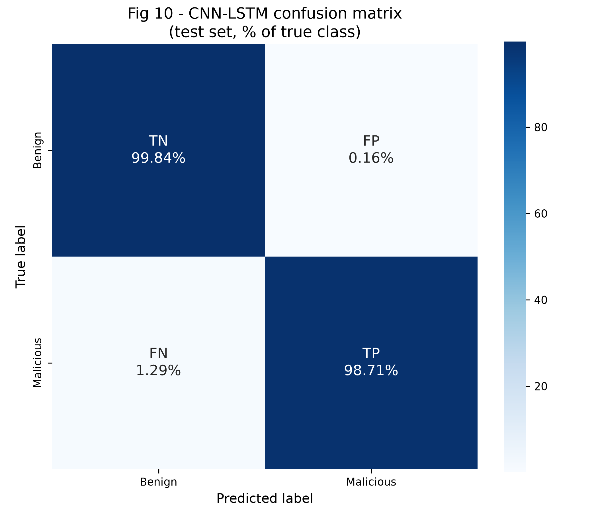

### 7.3 Training curves

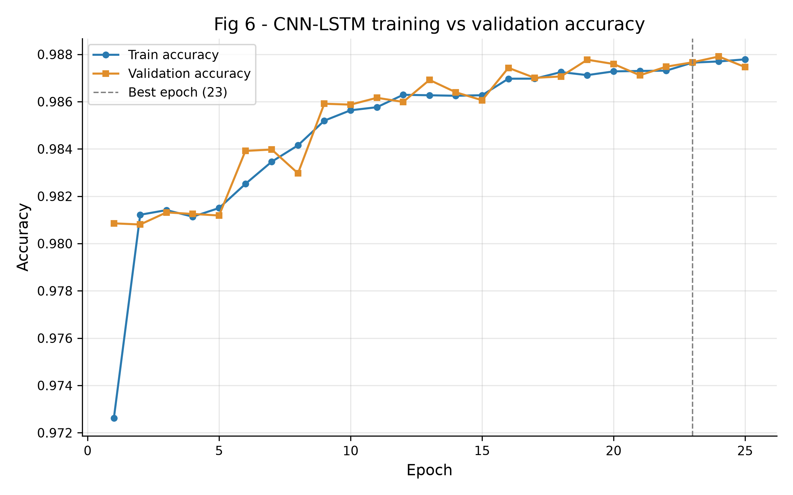
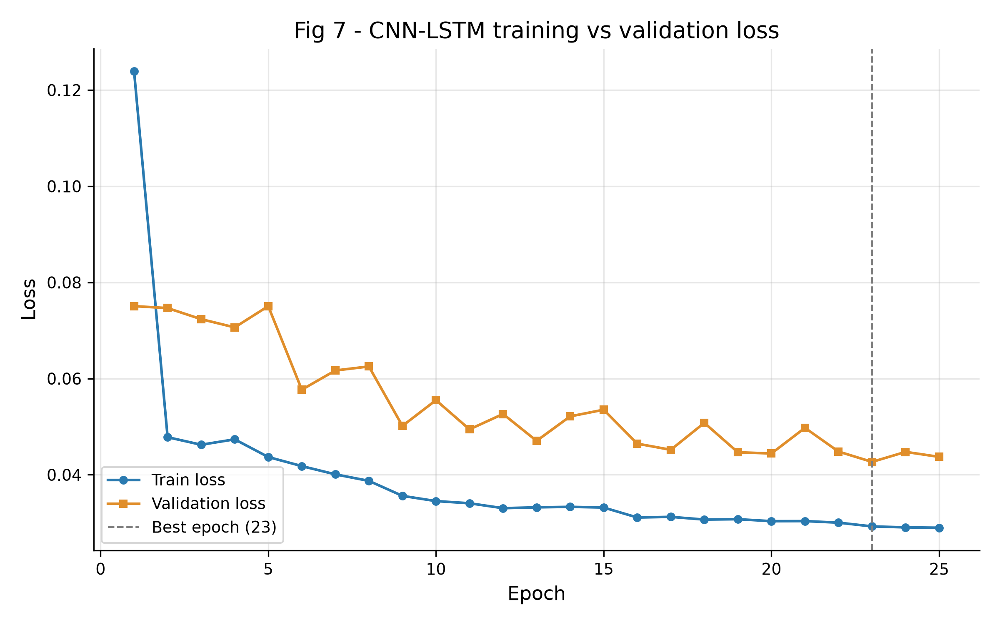

### 7.4 Baselines and cost

| Model | Params / nodes | Size (MB) | Train time (s) | Epochs (best) | Inference µs/sample | Throughput (samples/s) |
|---|---|---|---|---|---|---|
| CNN-LSTM | 79,902 | 1.043 | 996 | 25 (23) | 4.78 | 209,418 |
| CNN | 29,842 | 0.409 | 207 | 25 (23) | 4.58 | 218,299 |
| LSTM | 50,050 | 0.635 | 746 | 25 (23) | 3.85 | 259,619 |
| MLP | 13,762 | 0.195 | 105 | 16 (11) | 5.37 | 186,249 |
| RandomForest | 203,590 | 4.379 | 2 | RF on 300,000 rows | 0.47 | 2,107,146 |

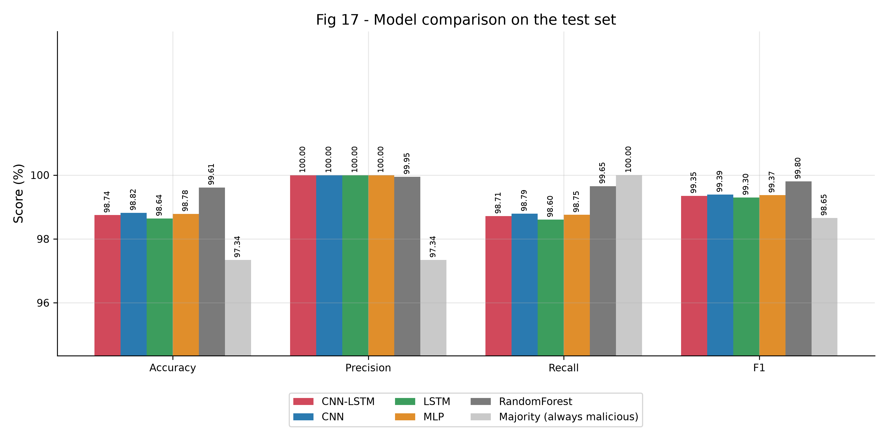
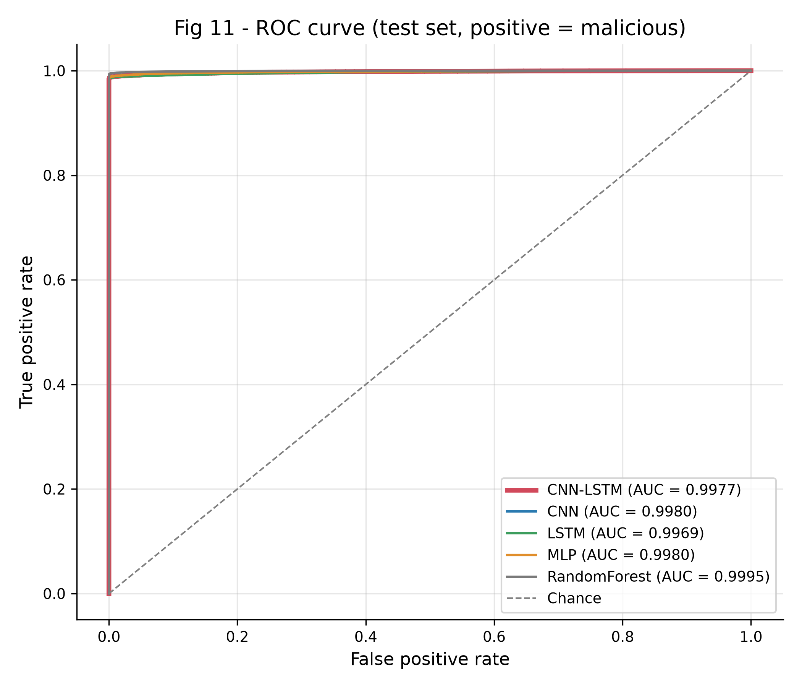

### 7.5 Our results vs the paper

| metric                                 |    paper |   ours_cnn_lstm |   majority_baseline |   abs_diff_vs_paper |   rel_diff_vs_paper_% |
|:---------------------------------------|---------:|----------------:|--------------------:|--------------------:|----------------------:|
| Accuracy (%)                           |  98.42   |         98.7447 |             97.342  |              0.3247 |                 0.33  |
| Precision, support-weighted (%)        | n/a      |         99.144  |             94.7546 |            n/a      |               n/a     |
| Recall, support-weighted (%)           | n/a      |         98.7447 |             97.342  |            n/a      |               n/a     |
| F1, support-weighted (%)               |  98.57   |         98.8599 |             96.0308 |              0.2899 |                 0.294 |
| Precision, malicious = positive (%)    | n/a      |         99.9955 |             97.342  |            n/a      |               n/a     |
| Recall / detection rate, malicious (%) | n/a      |         98.7149 |            100      |            n/a      |               n/a     |
| F1, malicious (%)                      | n/a      |         99.351  |             98.6531 |            n/a      |               n/a     |
| Benign precision (%)                   | n/a      |         67.9621 |              0      |            n/a      |               n/a     |
| Benign recall = specificity (%)        | n/a      |         99.8363 |              0      |            n/a      |               n/a     |
| Benign F1 (%)                          | n/a      |         80.8719 |              0      |            n/a      |               n/a     |
| False positive rate (%)                |   9.17   |          0.1637 |            100      |             -9.0063 |               -98.215 |
| False negative rate (%)                | n/a      |          1.2851 |              0      |            n/a      |               n/a     |
| Matthews corr. coef.                   | n/a      |          0.8184 |              0      |            n/a      |               n/a     |
| ROC-AUC                                | n/a      |          0.9977 |              0.5    |            n/a      |               n/a     |
| PR-AUC (average precision)             | n/a      |          0.9999 |              0.9734 |            n/a      |               n/a     |
| Cross-entropy loss                     |   0.0275 |          0.0443 |              0.4238 |              0.0168 |                61.091 |

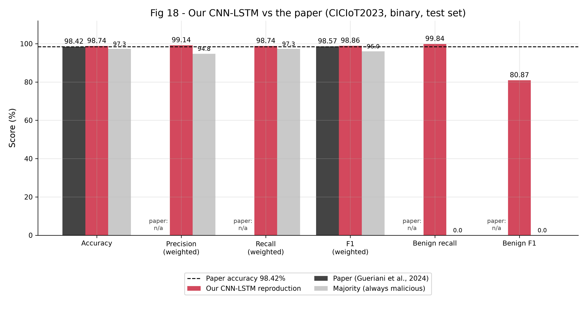

### 7.6 Cross-validation (stability)

5-fold stratified CV on a 150,000-row stratified subset of train+val (scaler re-fitted per fold, 8 epochs per fold; test set untouched).

| Metric | Mean | Std |
|---|---|---|
| accuracy | 98.142% | 0.130 pp |
| precision | 99.999% | 0.003 pp |
| recall | 98.093% | 0.132 pp |
| f1 | 99.036% | 0.068 pp |
| benign_recall | 99.950% | 0.112 pp |

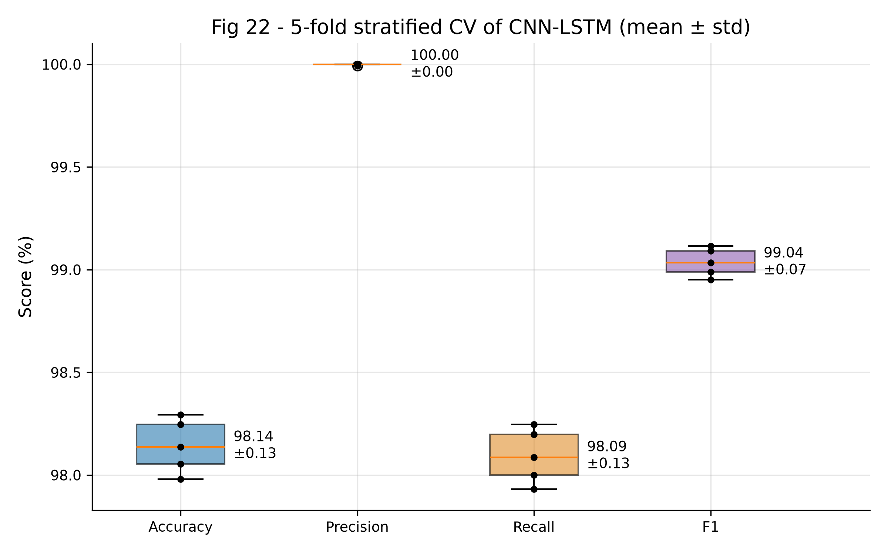

### 7.7 Edge deployment (TFLite, CPU, one sample at a time)

| Variant | Size (MB) | Latency (ms/sample, batch 1) | Accuracy | Drop (pp) |
|---|---|---|---|---|
| Keras float32 (GPU) | 1.043 | 15.262 | 98.750% | 0.000 |
| TFLite float32 | 0.420 | 0.084 | 98.750% | 0.000 |
| TFLite dynamic-range int8 | 0.197 | 0.037 | 98.755% | -0.005 |

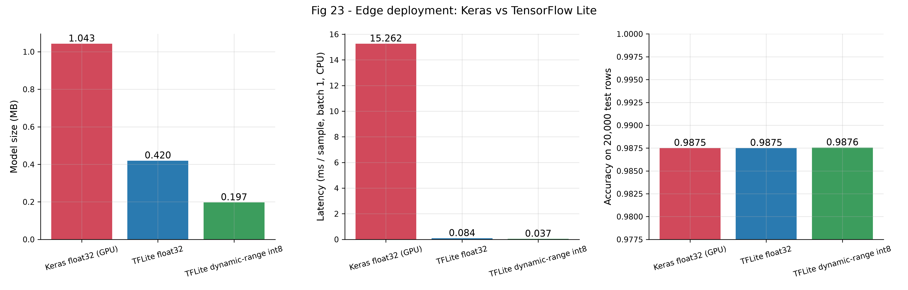

### 7.8 Additional experiments: threshold and class weights

Decision threshold chosen by maximising MCC on the **validation** split (test untouched), class-weighted model (`tools/tune_threshold.py`):

| Threshold (test set) | Accuracy | Attack recall | Benign recall | Benign precision | FPR | FNR | MCC | FP | FN |
|---|---|---|---|---|---|---|---|---|---|
| 0.5 (default) | 98.74 | 98.71 | 99.84 | 67.96 | 0.164 | 1.285 | 0.8184 | 8 | 2,300 |
| 0.0480 (tuned on validation) | 99.08 | 99.19 | 94.74 | 76.25 | 5.259 | 0.806 | 0.8455 | 257 | 1,442 |

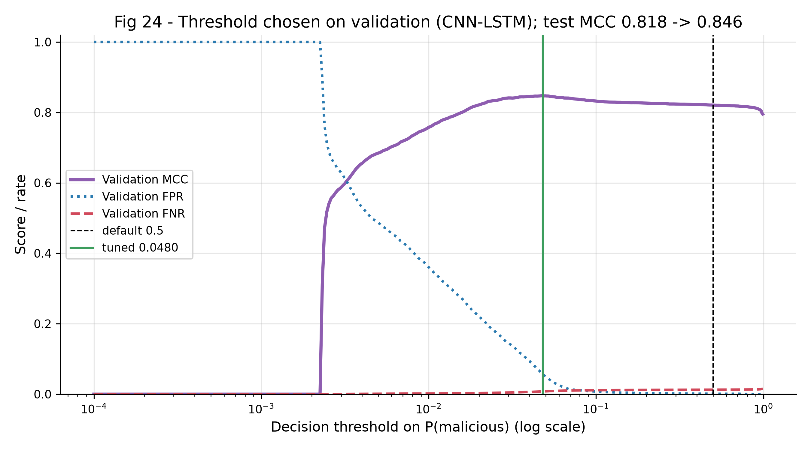

Same architecture and settings **without class weights** (`--balance none`, `outputs_nobalance/`), closer to the paper's unstated setup:

| Model | Accuracy | F1 (weighted) | Benign R | FPR | FNR | MCC | Loss | FP | FN |
|---|---|---|---|---|---|---|---|---|---|
| CNN-LSTM, no class weights | 99.30 | 99.32 | 93.29 | 6.71 | 0.53 | 0.8751 | 0.0162 | 328 | 951 |
| Paper | 98.42 | 98.57 | n/a | 9.17 | n/a | n/a | 0.0275 | n/a | n/a |

Threshold tuning for the unweighted model:

| Threshold (test set) | Accuracy | Attack recall | Benign recall | Benign precision | FPR | FNR | MCC | FP | FN |
|---|---|---|---|---|---|---|---|---|---|
| 0.5 (default) | 99.30 | 99.47 | 93.29 | 82.74 | 6.712 | 0.531 | 0.8751 | 328 | 951 |
| 0.5430 (tuned on validation) | 99.28 | 99.41 | 94.48 | 81.36 | 5.525 | 0.591 | 0.8731 | 270 | 1,058 |

Without class weights the errors move from missed attacks to false alarms; the FPR and loss land much closer to the paper's, which suggests the paper did not re-weight classes.

### 7.9 Where the model errs

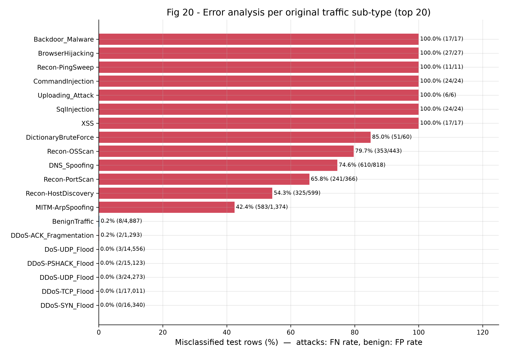

<!-- RESULTS:END -->

## 8. Simulation demo (live traffic replay)

```bash
python simulation.py --preview        # 5-second preview
python simulation.py                  # outputs/animations/traffic_replay.mp4 (1920x1080, 30 fps) + .gif + stills
```

`simulation.py` loads the trained model and the cached **real held-out test flows**. It picks ~600 of
them with a fixed seed and predicts all of them in **one** batched `model.predict` call, then replays
the precomputed results. Nothing is synthetic or hard-coded. The animation shows:
- a scrolling flow feed with the true attack type, the verdict, the confidence and the outcome
- a probability gauge with the threshold
- a running confusion matrix
- running accuracy, precision, recall and F1 with the attack bursts shaded

The script asserts that the animation's final confusion matrix equals sklearn's on the same flows.
It saves `replay_log.csv` (flow indices and predictions) and `replay_metrics.json`.

**Caveat:** the stream is re-sampled for readability (long benign stretches plus named attack bursts),
so its running metrics describe that demo subset only. The reported results are the full-test-set
numbers in section 7 and the paper comparison. `training_curves_animated.gif` replays the real
training history epoch by epoch.

MP4 needs ffmpeg. The system ffmpeg is used if installed (`sudo apt install ffmpeg`); otherwise the
static binary shipped in the `imageio-ffmpeg` pip package. Without either, only the GIF is written.

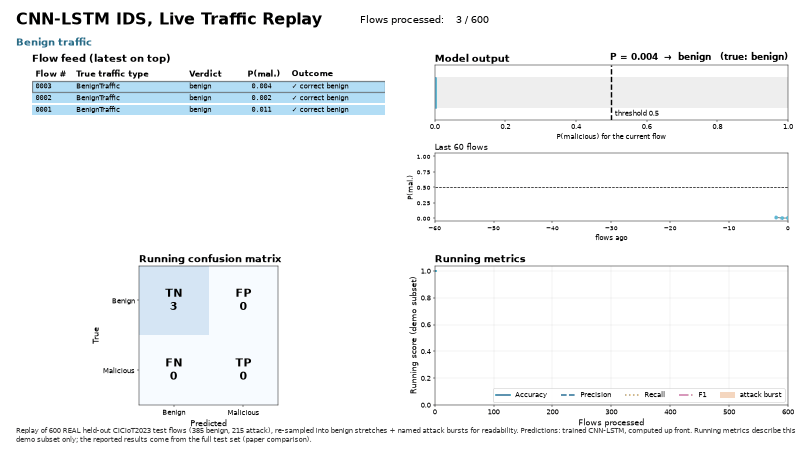

Outputs (`outputs/animations/`):
- `traffic_replay.mp4`: 1920×1080, H.264, 30 fps, 40 s
- `traffic_replay.gif`: 800 px wide, 12.5 fps
- `traffic_replay_final_16x9.png`: slide-ready still
- `training_curves_animated.gif`
- `replay_log.csv` and `replay_metrics.json`: marked *demo subset*
- `render_report.json`: ffmpeg-probed duration, resolution and codec

**Talking points while the animation plays**
1. "This is our trained CNN-LSTM replaying real, held-out CICIoT2023 flows it never saw in training.
   Every verdict is the model's actual output."
2. "Benign traffic stays low on the gauge, far below the 0.5 threshold. When the DDoS burst starts,
   the probability jumps to about 1.0 and the alert fires."
3. "Watch the confusion matrix: false alarms stay near zero, which matters for a real IDS."
4. "The recon and spoofing bursts are harder, and some of those flows are missed. That matches our
   error analysis: low-volume attacks look like normal traffic at the flow level."
5. "The stream is re-sampled so the demo is watchable. Our reported numbers (98.74% accuracy vs the
   paper's 98.42%) come from all 183,857 test flows, not from this clip."

